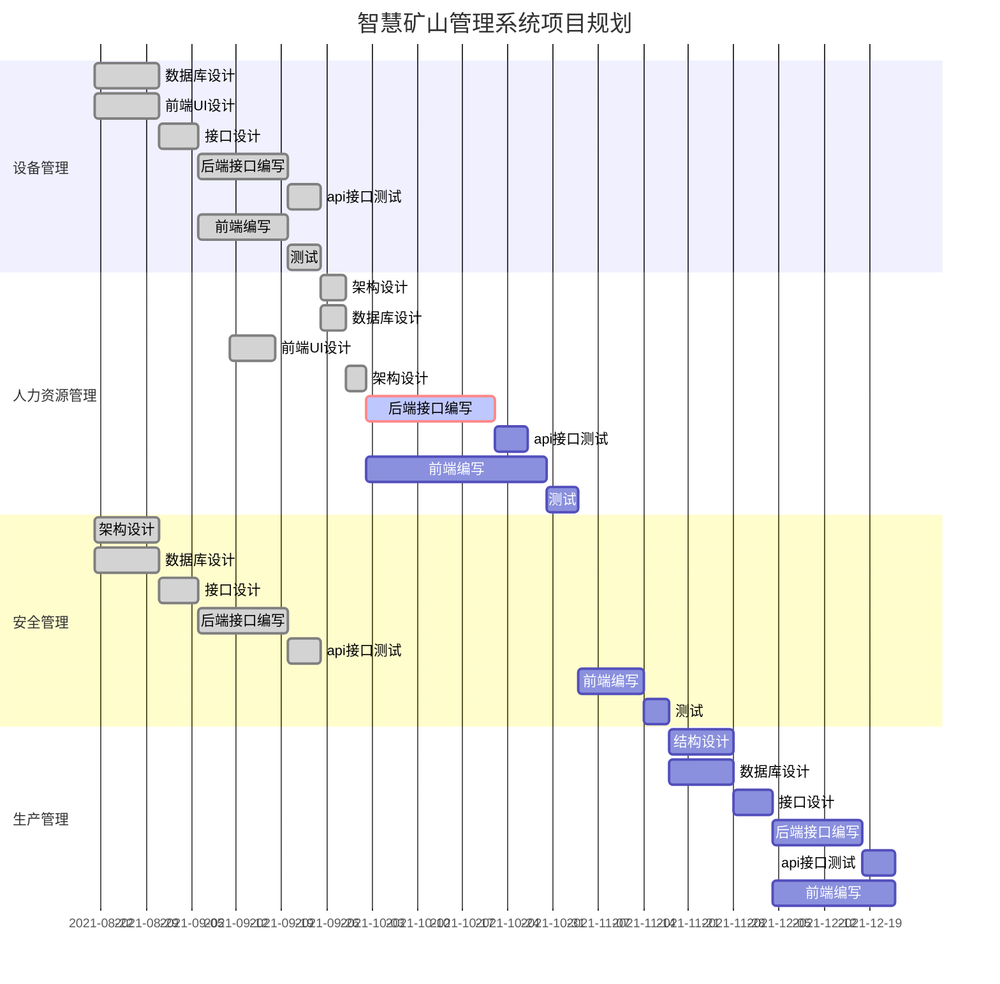

# SmartMine


## Project name

smartmine

## System architecture


## Development technology selection

### Development mode

Front end and back end separated


### Front End Frame

Vue.js v2.5.2  (https://cn.vuejs.org/)

### UI framework

Ant Design Vue  v1.7.8 (https://www.antdv.com/)


### The back-end framework

django V3.2.6 (https://www.djangoproject.com/)


### The database

Mysql v5.7.26 (https://www.mysql.com/)


## Project planning




## Project directory


```

├── README.md
├── smartminefrontend
│   ├── build
│   │   ├── build.js
│   │   ├── check-versions.js
│   │   ├── logo.png
│   │   ├── utils.js
│   │   ├── vue-loader.conf.js
│   │   ├── webpack.base.conf.js
│   │   ├── webpack.dev.conf.js
│   │   └── webpack.prod.conf.js
│   ├── config
│   │   ├── dev.env.js
│   │   ├── index.js
│   │   └── prod.env.js
│   ├── index.html
│   ├── package-lock.json
│   ├── package.json
│   ├── README.md
│   ├── src
│   │   ├── App.vue
│   │   ├── assets
│   │   ├── components
│   │   ├── main.js
│   │   └── router
│   └── static
├── smartmine_django
│   ├── api
│   │   ├── admin.py
│   │   ├── apps.py
│   │   ├── extensions
│   │   ├── migrations
│   │   ├── models.py
│   │   ├── serializers.py
│   │   ├── tests.py
│   │   ├── urls.py
│   │   ├── utils
│   │   ├── views.py
│   │   ├── __init__.py
│   │   └── __pycache__
│   ├── db.sqlite3
│   ├── manage.py
│   ├── media
│   ├── requirements.txt
│   ├── smartmine_django
│   │   ├── asgi.py
│   │   ├── settings.py
│   │   ├── urls.py
│   │   ├── wsgi.py
│   │   ├── __init__.py
│   │   └── __pycache__
│   ├── static
│   │   └── demoUploduser.xlsx
│   └── venv
│       ├── Lib
│       ├── pyvenv.cfg
│       └── Scripts

```

